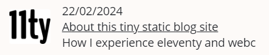
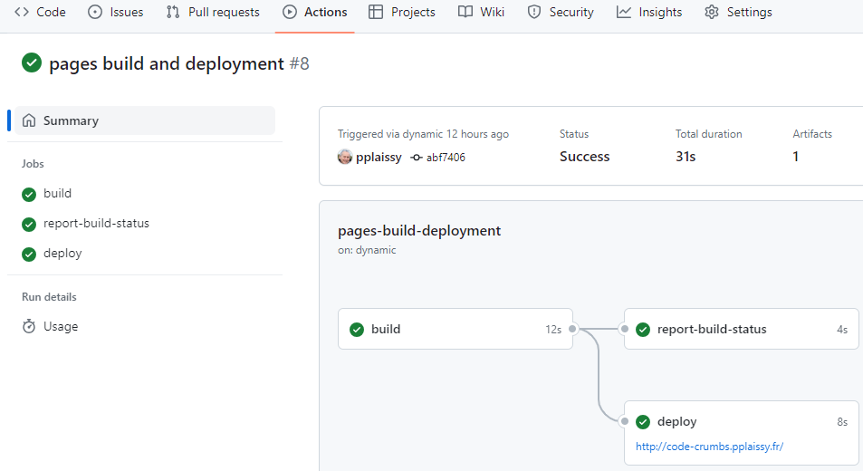

When you plan to deploy a site on github pages, the doc tells you that github uses Jekyll by default and in retrospect I say to myself that I probably should have left it there.

But after reading everything and its opposite about the existing static site generators I ended up choosing eleventy. I must say that it was [Sara Soueidan](https://twitter.com/SaraSoueidan/status/1144696081403523072){.xlk}'s comment whose contributions I greatly appreciated on [codrops](https://tympanus.net/codrops/author/sarasoueidan/){.xlk} which won my decision. So, which language template to choose ? webc looks promising, let's go!

This blog site is therefore set up with [eleventy](https://www.11ty.dev){.xlk} and [webc](https://www.11ty.dev/docs/languages/webc/){.xlk}.

Let me know if the following tips were useful for your own project.

## Architecture

I wanted something really basic, a blog site reduced to its simplest expression. No About page, no contact form (you can reach me on LinkedIn if necessary), no inanity like 'I like to blog about the stuff I'm interested in'. Just a home page with the posts list linking to each post page.

After a while I even removed the footer.

## Layout

The header must obviously be on each page. To do this, you must create a layout file and indicate the name of the file in the front matter. The syntax that you will find everywhere is the following considering that my layout file is called main.webc and is located in the layouts folder:

`layout: layouts/main.webc`

But it is also possible to simplify the declaration in the front matter as  `layout: main.webc` provided that you declare the layouts folder inside the config file :

```json
dir: {
    ...
	layouts: "_includes/layouts"
}
```

### cascading

There is a second layout for rendering an article, `post.webc`. It's just a container that references the main layout and displays the content of the post.

```html
---
layout: main.webc
---

<div @html="content"></div>
```


## Relative links

One of the difficulties I encountered is the syntax of links in the main layout (main.webc), whose href is of the form 'assets/sub-folder/resource-file'. For example :

`<link rel="stylesheet" href="assets/css/main.css" webc:keep/>`

When you are on the main page, no problem, the resource file is found. But when you navigate to an article whose page is nested in the site tree, the resource becomes inaccessible.


I did lots of tests in all directions, some of which worked locally but not once built on github.

I ended up finding a simple solution that takes one line in the header and conditionally adds a base ref when you are on an article page:

`<base webc:if="this.page.url.includes('posts')" href="../..">`

## External links target

For external links, those which refer to pages outside the site, it seems preferable to open them by default in a new browser tab. To do this, simply add the attributes {target="_blank" rel="noopener noreferrer"} following the link but obviously we do not want them to appear in the html rendering.

A little research quickly led me to two options:

- [markdown-it-for-inline](https://www.npmjs.com/package/markdown-it-for-inline){.xlk} dont l'utilisation est décrite dans cet article de [Frank Noirot](https://v2.franknoirot.co/posts/external-links-markdown-plugin/){.xlk}
- [markdown-it-attrs](https://www.npmjs.com/package/markdown-it-attrs){.xlk} dont il est question sur ce [thread github](https://github.com/11ty/eleventy/issues/2301){.xlk}

I opted for the second which seemed simpler to me.

`const md = new markdownIt(options).use(markdownItAttrs);`

Well, we must admit that it can quickly become tiresome to copy all these attributes following each external link. In this paragraph alone it is there four times. We quickly wonder if it wouldn't be possible to make things simpler. 

And yes, it’s possible! Using a {.xlk} class (for example) instead. Lighter and more readable, right?

This requires customizing the markdown renderer so that it adds the attributes when the class is present, but it's worth it. These few lines in the .eleventy.js and voila!

```js
// set an instance of markdownIt
const md = new markdownIt(options).use(markdownItAttrs);

// declare a default link renderer
const defaultLinkRender = md.renderer.rules.link_open || function (tokens, idx, options, env, self) {
  return self.renderToken(tokens, idx, options);
};

// set custom render function
md.renderer.rules.link_open = (tokens, idx, options, env, self) => {
  const token = tokens[idx];
  // get the class attribute
  const classAttr = token.attrGet("class");
  // if class attribute exists and contains the external link flag...
  if (classAttr && classAttr.split(' ').includes("xlk")) {
    // ...add the custom attributes
    tokens[idx].attrSet('target', '_blank');
    tokens[idx].attrJoin("rel", "noopener noreferrer");
  }

  // Pass the token to the default renderer.
  return defaultLinkRender(tokens, idx, options, env, self);
};
```

## Dates

Regarding dates, I needed to display the post date on the home page post list items:



For this I use [Luxon](https://moment.github.io/luxon/#/){.xlk} and declare a function in the config file :

```js
eleventyConfig.addJavaScriptFunction("postDate", (dateObj) => {
	return DateTime.fromJSDate(dateObj).toLocaleString(DateTime.DATE_SHORT);
});
```

that I call inside the posts list component :

```
<span @html="postDate(post.data.date)"></span>
```

## Posts collection

In the middle of writing a new article it may happen that you have to make a update to the site (design, typo on another article, etc.). But if you make a commit, the draft of your unfinished article will also be published. To avoid this, simply tag the articles in the front matter as "published" or "draft" and declare the collection in the config file.

```js
eleventyConfig.addCollection("posts", function(collectionApi) {
	return collectionApi.getFilteredByTag("published").sort(function(a, b) {
  		return b.date - a.date; // sort by date - descending
	});
});
```

## CI

The CI gave me a bit of trouble, the examples found being a bit old or targeting other configurations. And the yaml syntax gave me a headache 🤒. It's a little more tricky but I choose the two repos configuration. A private one to store the source (which contains the drafts) and a public one for the deployment of the site. A commit on the private repo triggers the build and a commit of the target folder content on the private repo which itself triggers the deployment.

```xml
name: build 11ty site

on:
  push:
    branches: ["main"]

permissions:
  contents: read
  pages: write
  id-token: write

concurrency:
  group: "pages"
  cancel-in-progress: false

jobs:

  build:
    runs-on: ubuntu-latest
    steps:
      - uses: actions/checkout@v4
      - uses: actions/setup-node@v4
      - name: Install dependencies & build
        run: |
          npm install
          npx @11ty/eleventy
      - uses: actions/upload-pages-artifact@v3

      # Deploy the Static Site to Public Repo (GitHub Pages)
      - name: Deploy
        uses: JamesIves/github-pages-deploy-action@v4.3.3
        with:
          token:  ${{ secrets.YOUR-SECRET-NAME }}
          repository-name: pplaissy/code-crumbs-site
          branch: main # The branch the action should deploy to.
          folder: _site # The folder the action should deploy.
          single-commit: true
          commit-message: "Deploy by source"
```

During the development phase you may have errors. To find out what's happening, go to the Actions tab of the repo.



## Scripting

I use [Typora](https://typora.io/){.xlk} for writing.

Creating a new article simply involves adding a .md file to the site's posts folder and inserting the front matter there:

```
layout: post.webc
title: About this tiny static blog site
tags: post
description: "How I experience eleventy and webc"
date: 2024-03-06
image: 
    path: ../assets/img/11ty/posts/11ty.png
    alt: 11ty logo
```

Then I like to put Typora and my localhost site side by side and visualize the result as I type. 😁.

Except there is still one problem...

## Local images paths

When I insert an image into Typora, its path is logically "../assets/etc." and, if the result is correct in localhost, on the online site the image is no longer found since a `<base href="../..">` was added to the main layout. To get around this difficulty, I modified the markdown renderer of the images in the config file:

```
md.renderer.rules.image = function (tokens, idx, options, env, self) 
{
    const token = tokens[idx];
    let src = token.attrGet('src');

    // truncate paths for local images 
    token.attrSet('src', src.slice(3));
    token.attrSet('alt', token.content);

    return self.renderToken(tokens, idx, options)
}
```

## Conclusion

That was my modest contribution to the eleventy universe. You'll tell me what you think about it.

We have a really simple and easy to maintain static site with few files and few code in each.

The only downside is this matter of resolving the paths using the base ref and the custom image markdown renderer. It's a bit of a DIY job and I guess I've missed something. If anyone could point me in the right direction that would be great.

